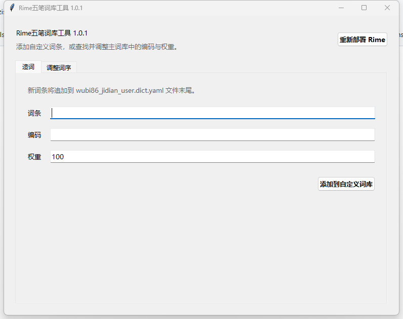

# 方案连接
[ 86 版极点五笔的输入配置方案]([https://github.com/mozisen/rime/releases](https://github.com/KyleBing/rime-wubi86-jidian?tab=readme-ov-file)

# Rime五笔词库工具

一个用于维护 Rime 小狼毫极点五笔词库的 Windows 图形化工具。

当前版本：**1.0.1**

## 下载

请前往 [Releases](https://github.com/mozisen/rime/releases) 下载最新版本的
`Rime-Wubi-Dictionary-Tool-版本号.exe`。程序运行后显示中文界面。

## 软件界面



## 功能

### 造词

输入词条、编码和权重后，工具会按以下格式追加到
`wubi86_jidian_user.dict.yaml` 文件末尾：

```text
词条<Tab>编码<Tab>权重
```

工具会自动检查空字段、换行符和非法权重，避免写入格式错误的记录。

### 调整词序

输入完整词条后，工具会从 `wubi86_jidian.dict.yaml` 中读取对应记录：

- 显示词条、编码、权重和所在行；
- 支持一个词条对应多个编码；
- 选择指定记录后，可以修改词条、编码或权重；
- 只更新选中的记录，保留其他词条和扩展字段。

每次修改主词库前，工具都会自动生成最近一次备份：

```text
wubi86_jidian.dict.yaml.bak
```

### 重新部署 Rime

点击界面右上角的“重新部署 Rime”按钮，工具会：

1. 从 Windows 注册表自动查找当前安装的小狼毫；
2. 调用 `WeaselDeployer.exe /deploy`；
3. 在后台完成重新部署；
4. 显示部署成功、失败或超时提示。

升级小狼毫后，工具仍会自动识别新的安装目录。

## 使用方法

1. 下载 `Rime-Wubi-Dictionary-Tool-版本号.exe`。
2. 将它放入 Rime 用户配置目录，或保持在当前工具目录中运行。
3. 使用“造词”页面添加自定义词条。
4. 使用“调整词序”页面查找并修改主词库记录。
5. 修改完成后，点击右上角“重新部署 Rime”使词库生效。

默认的 Rime 用户配置目录通常为：

```text
C:\Users\你的用户名\AppData\Roaming\Rime
```

工具会依次在 EXE 所在目录、当前目录和系统 Rime 配置目录中查找以下文件：

```text
wubi86_jidian_user.dict.yaml
wubi86_jidian.dict.yaml
```

## 系统要求

- Windows 10 或 Windows 11；
- 已安装 Rime 小狼毫输入法；
- 使用极点五笔 86 词库；
- EXE 为 64 位单文件程序，无需安装 Python。

## 从源码运行

源码仅使用 Python 标准库：

```powershell
python rime_dict_tool.py
```

运行测试：

```powershell
python -m unittest -v
```

构建单文件 EXE：

```powershell
python -m pip install pyinstaller
python -m PyInstaller --noconfirm --clean --onefile --windowed `
  --name "Rime五笔词库工具" rime_dict_tool.py
```

## 项目文件

- `rime_dict_tool.py`：程序源码；
- `test_rime_dict_tool.py`：词库读写和部署程序定位测试；
- `使用说明.txt`：简明使用说明；
- `Rime-Wubi-Dictionary-Tool-版本号.exe`：在 GitHub Release 中提供。

## 注意事项

- 修改词库前建议退出正在编辑同一文件的其他程序；
- 修改主词库后请执行重新部署；
- `.bak` 文件只保存最近一次修改前的主词库；
- Windows 可能会对未签名的个人程序显示安全提醒，请确认下载来源为本仓库。
